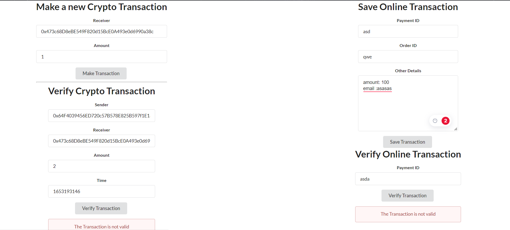
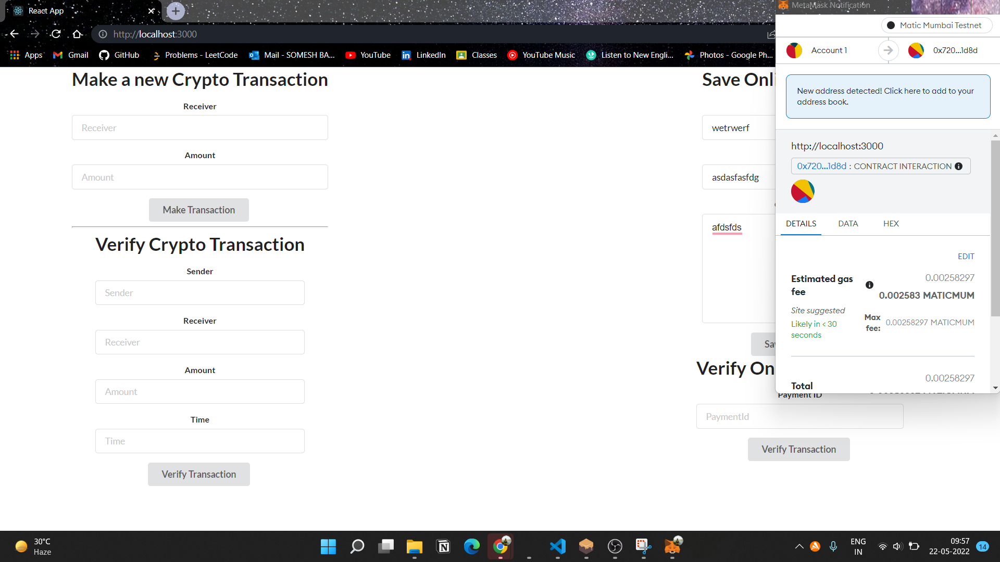

<h1 align="center">Transaction Verifier</h1>

Build at: [**Hack The Crisis 2.0**](https://hack-the-crisis.devfolio.co/)


## Table of Contents:
- [Introduction](#Introduction)
- [To Run on Localhost](#LocalImplementation)
- [Technology Stack](#Technology-Stack)
- [Features](#Features)
- [Screenshots and Video](#ScreenshotsandVideo)
- [Contributors](#Contributors)

## Introduction
There are a lot of malicious activities going on with making online payments. The payments are forged, and unable to verify whether it is successful or not. Also when we are asked for verification, it is served from a centralized server which is prone to a single point of failure and other vulnerabilities. In our solution, we have proposed a system in which after an online transaction is done, it is stored in the blockchain with its hash. So we can check whether the transaction has happened or not and also the integrity of the details with the hash. But we are moving to web3 and online transactions are not the only way to do a payment. So we have also added support for crypto transactions. The other less important details of transactions are stored in IPFS to reduce pressure on the blockchain.

## Local Implementation
1. Clone the Repo and istall dependencies
```
git clone <repo>
cd <repo>
npm install
```
2. Install metamask in your browser and log into your metasmask account.
3. Run the local webserver with any port.
```
npm start
```


## Technology Stack
1) Polygon Blockchain
2) Solidity
3) Ethers JS
4) IPFS
5) Metamask Wallet
6) React JS

## Features
1. Can make a Ether transaction and verify it.
2. Can store Online transaction in the blockchain with its hash, so that later the integrity can be checked.
3. Integrity of online transaction can be checked by both the Payment ID or by entering all the details.


## Screenshots and Video



[Video](https://youtu.be/-hkEFlWxu0Q)

## Contributors:

Team Name: Abstract Team

* [Somesh Banerjee](https://github.com/somesh-banerjee)